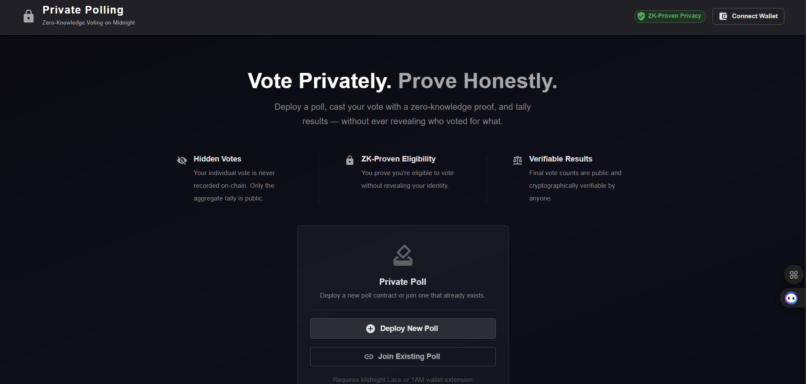

# Private Polling — Privacy-Preserving Voting DApp on Midnight Network 🗳️

[](https://github.com/SATISH-JALAN/private-pooling/actions/workflows/ci.yaml)

A zero-knowledge, privacy-preserving polling application built on the Midnight Network using Compact smart contracts. Users can create polls, cast votes, and view aggregate results — without ever exposing their individual vote or identity.

**Level 3 idea:** [Private Voting](#initial-idea) — anonymous ballots with publicly verifiable tallies.

---

## Contract Address

| Network | Contract Address |
|---------|------------------|
| Preprod | `0200dbf964f541e1950883f5b2f539b66fd6111e46ce8e6e9551fbdd180114d5dd5b` |

```env
CONTRACT_ADDRESS=0200dbf964f541e1950883f5b2f539b66fd6111e46ce8e6e9551fbdd180114d5dd5b
```

---

## Features

- 🗳️ **Private Voting** — Cast Yes, No, or Abstain votes protected by Zero-Knowledge proofs
- 🔒 **Identity Protection** — Voters prove eligibility without revealing their identity or secret key
- 📊 **Transparent Tallies** — Public ledger tracks aggregate vote counts in real time
- 👑 **Creator Controls** — Only the poll creator can close polls, verified via ZK proof
- 🌐 **Web UI** — Modern React interface with live vote bars and wallet integration
- 💻 **CLI** — Command-line tool for deploying and interacting with polls directly

---

## What This Project Does

Private Polling lets users run decentralized, transparent polls while keeping individual votes completely private.

In traditional voting systems, you either trust a centralized server or make your vote public on a blockchain. Private Polling solves this using Midnight's ZK-proof architecture:

1. A user deploys the contract and creates a poll with a question
2. Participants connect their Midnight wallet and cast votes (Yes / No / Abstain)
3. The Midnight circuit generates a ZK proof **locally on the voter's device**
4. The proof proves a valid vote was cast without linking the voter's identity to the choice
5. Aggregate vote totals update on-chain for everyone to verify

---

## Privacy Model

| Data | Visibility |
|------|-----------|
| Poll question | ✅ Public |
| Poll status (Open / Closed) | ✅ Public |
| Vote counts (Yes / No / Abstain) | ✅ Public |
| Poll creator (hashed) | ✅ Public |
| **Individual vote choice** | ❌ Private — never recorded on-chain |
| **Voter identity** | ❌ Private — proven via ZK, not disclosed |
| **Secret key** | ❌ Private — never leaves the device |

### ZK Proof Guarantees

- Voters prove they possess a valid secret key using the `localSecretKey()` witness — without disclosing it
- Poll creators prove ownership via `derivedPublicKey()` inside ZK circuits — without revealing the underlying key
- Only public inputs/outputs are disclosed using Compact's explicit `disclose()` operator

---

## Tech Stack

| Layer | Technology |
|-------|-----------|
| Smart Contract | Compact `v0.23` — Midnight ZK smart contract language |
| ZK Proofs | Midnight Proof Server (`midnightnetwork/proof-server`) |
| Frontend | React 19, TypeScript, Material-UI (MUI v9), Vite |
| Wallet | Midnight Lace / 1AM wallet (`@midnight-ntwrk/dapp-connector-api`) |
| CLI | Node.js, RxJS, Pino, LevelDB private state |
| Blockchain | Midnight Preprod testnet |

---

## Folder Structure

```
midnightt lvl 1/
├── contract/                        # Compact smart contract
│   ├── src/
│   │   ├── private-polling.compact  # Core ZK smart contract
│   │   ├── witnesses.ts             # Private state witnesses
│   │   └── index.ts                 # Contract exports & compiled bindings
│   └── package.json
├── api/                             # Shared contract API library
│   ├── src/
│   │   ├── common-types.ts          # TypeScript types & derived state
│   │   └── index.ts                 # PrivatePollingAPI class
│   └── package.json
├── private-polling-cli/             # Command Line Interface
│   ├── src/
│   │   ├── deploy-direct.ts         # Non-interactive deployment script
│   │   ├── config.ts                # Network configs (preprod / preview)
│   │   ├── midnight-wallet-provider.ts
│   │   └── generate-dust.ts         # UTXO dust registration
│   └── package.json
├── private-polling-ui/              # React Web Application
│   ├── src/
│   │   ├── components/              # Board, Layout, voting UI
│   │   ├── contexts/                # Wallet & deployment manager
│   │   ├── hooks/                   # React hooks
│   │   └── App.tsx                  # Root application
│   └── package.json
├── README.md
└── package.json                     # Workspace root
```

---

## Prerequisites

| Requirement | Version / Notes |
|------------|----------------|
| Node.js | v22+ (`node -v`) |
| Docker Desktop | Installed and running |
| Midnight wallet | [1AM](https://chromewebstore.google.com/detail/1am/bphnkdkcnfhompoegfpgnkidcjfbojjp) or [Lace Midnight Preview](https://chromewebstore.google.com/detail/lace-midnight-preview/hgeekaiplokcnmakghbdfbgnlfheichg) |
| Proof Server | Running on port 6300 (see below) |

### Start the Proof Server

```bash
docker run -d -p 6300:6300 midnightnetwork/proof-server
```

---

## Installation

```bash
# Root dependencies
npm install

# API
cd api && npm install && cd ..

# Contract
cd contract && npm install && cd ..

# CLI
cd private-polling-cli && npm install && cd ..

# UI
cd private-polling-ui && npm install && cd ..
```

---

## Compile Compact Contract

Requires the [Compact compiler](https://github.com/midnightntwrk/compact) (`compact`) on your `PATH`, pinned to the same version CI uses ([`.github/workflows/ci.yaml`](.github/workflows/ci.yaml)):

```bash
npm run compact
```

The official installer only ships Linux/macOS binaries, so on Windows run it inside a Linux container instead:

```bash
docker run --rm -v "${PWD}:/work" -w /work/contract debian:bookworm-slim bash -c "
  apt-get update -qq && apt-get install -y -qq curl xz-utils unzip ca-certificates &&
  curl --proto '=https' --tlsv1.2 -LsSf https://github.com/midnightntwrk/compact/releases/latest/download/compact-installer.sh | sh &&
  export PATH=\$HOME/.local/bin:\$PATH &&
  compact update 0.31.0 &&
  compact compile src/private-polling.compact ./src/managed/private-polling
"
```

---

## Build

```bash
# Build everything
npm run build

# Build CLI only
cd private-polling-cli && npm run build && cd ..

# Build UI only
cd private-polling-ui && npm run build && cd ..
```

---

## Testing

The Compact contract has a unit test suite that exercises the compiled circuits directly (no proof server or network required) using `@midnight-ntwrk/compact-runtime`'s local simulator.

```bash
cd contract
npm run test
```

The suite (`contract/src/test/private-polling.test.ts`) covers:

- **Identity hashing** — `derivedPublicKey` is deterministic for a given secret key and differs across secret keys, so no two voters can be linked to the same identity hash.
- **Initial state** — a freshly deployed contract starts `CLOSED` with no question and zeroed tallies.
- **`createPoll`** — opens the poll, stores the question, and discloses only the hashed owner (never the raw secret key); rejects opening a second poll while one is already open.
- **`castVote`** — tallies Yes/No/Abstain choices into public counters without recording which voter cast which vote; rejects out-of-range choices and votes after the poll is closed.
- **`closePoll`** — only succeeds for the secret key that matches the poll's disclosed owner hash; a different key is rejected.

This runs as part of CI (`npm run ci` inside `contract/`, wired into [`.github/workflows/ci.yaml`](.github/workflows/ci.yaml)) on every push and pull request to `main`.

## Run Locally (Development)

```bash
cd private-polling-ui
npm run dev
```

Open **http://localhost:5173** in your browser. Make sure your Midnight wallet extension is installed and connected to Preprod.

---

## Deploy the Contract

### Prerequisites
1. Docker proof server running on port 6300
2. Fund your wallet at **https://midnight-tmnight-preprod.nethermind.dev/**  
   Wallet address: `mn_addr_preprod1cnd58wudtqdm8g5ufe0r7mpsd690vesnhmgsze9d96pwu03szg5qqsqzdj`

### Run Deployment

```bash
cd private-polling-cli
npm run deploy-direct
```

On success you will see:

```
====================================================
DEPLOYMENT SUCCESSFUL!
Contract Address: 0200dbf964f541e1950883f5b2f539b66fd6111e46ce8e6e9551fbdd180114d5dd5b
====================================================
```

---

## Environment Variables

| Variable | Description | Value |
|----------|-------------|-------|
| `VITE_NETWORK_ID` | Midnight network | `preprod` |
| `VITE_LOGGING_LEVEL` | Log verbosity | `trace` |
| `CONTRACT_ADDRESS` | Deployed contract address | `0200dbf964f541...` |

---

## Screenshots

### Web UI — Landing Page



> The main interface showing the hero section, privacy model features, wallet connection button, and the poll card for deploying or joining a poll.

### Private Polling CLI

> Run `npm run deploy-direct` inside `private-polling-cli/` to deploy and interact via terminal.

---

## Initial Idea

**Idea #11 — Private Polling** from the Midnight Builder Level 1 Challenge, carried forward for Level 3 as **Private Voting** (anonymous ballots with publicly verifiable tallies) from the Level 3 provided idea list.

The goal: allow anonymous, verifiable on-chain voting where individual choices are confidential via ZK proofs, while aggregate tallies remain transparent and cryptographically verifiable on the Midnight ledger.

---

## Troubleshooting

| Problem | Fix |
|---------|-----|
| Proof server connection failed | Run `docker run -d -p 6300:6300 midnightnetwork/proof-server` and verify with `docker ps` |
| Wallet not detected | Ensure Midnight Lace or 1AM extension is enabled and connected to Preprod network |
| Out of memory during deployment | Use `node --max-old-space-size=8192` (already set in `deploy-direct` script) |
| Dust balance 0 after registration | Wait 2-5 minutes and re-run — the preprod network takes time to generate dust from registered UTXOs |
| WebSocket disconnects | Normal on preprod — the script reconnects automatically |
